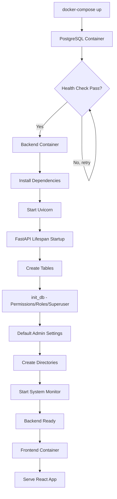

# Docker Setup and Integration Guide

## Overview
This document explains the complete Docker setup, integration points, and data loading process for the E-Commerce Recommendation System.

## Architecture

### Services
The application consists of 4 services orchestrated via `docker-compose.yml`:

1. **postgres** - PostgreSQL 15 database with pgvector extension
2. **backend** - FastAPI application (Python 3.11)
3. **frontend** - Vite/React application
4. **pgadmin** - Database management UI (optional, `--profile tools`)

### Dependencies
```
postgres (health check) → backend (depends_on) → frontend (depends_on)
```

## Startup Flow

### 1. Docker Compose → PostgreSQL Container
**File**: `docker-compose.yml`

```yaml
postgres:
  image: pgvector/pgvector:pg15-v0.5.0
  container_name: ecommerce-postgres
  environment:
    - POSTGRES_USER=${POSTGRES_USER}
    - POSTGRES_PASSWORD=${POSTGRES_PASSWORD}
    - POSTGRES_DB=${POSTGRES_DB}
  healthcheck:
    test: ["CMD-SHELL", "pg_isready -U ${POSTGRES_USER}"]
    interval: 10s
    timeout: 5s
    retries: 5
```

**Actions**:
- Creates PostgreSQL database with pgvector extension
- Waits for health check to pass (pg_isready)
- Persists data in `postgres_data` volume

### 2. Docker Compose → Backend Container
**File**: `services/backend/Dockerfile`

```dockerfile
FROM python:3.11-slim

# Install system dependencies
RUN apt-get update && apt-get install -y \
    gcc postgresql-client curl && \
    rm -rf /var/lib/apt/lists/*

# Install Python packages
COPY requirements.txt .
RUN pip install --no-cache-dir -r requirements.txt

# Copy application code
WORKDIR /app
COPY . /app

# Create directories
RUN mkdir -p /app/static/uploads /app/logs

# Health check
HEALTHCHECK --interval=30s --timeout=10s --start-period=40s \
    CMD curl -f http://localhost:8000/health || exit 1

# Start application
CMD ["uvicorn", "app.main:app", "--host", "0.0.0.0", "--port", "8000", "--reload"]
```

**Actions**:
1. Waits for postgres health check to pass
2. Builds Python 3.11-slim image with dependencies
3. Copies backend code to `/app` directory
4. Creates `static/uploads` and `logs` directories
5. Runs uvicorn server on port 8000

### 3. Uvicorn → FastAPI App Startup
**File**: `services/backend/app/main.py`

```python
@asynccontextmanager
async def lifespan(app: FastAPI):
    logger.info("Launch: Starting up ecommerce backend...")
    
    # 1. Create all database tables
    Base.metadata.create_all(bind=engine)
    
    # 2. Initialize database with base data
    db = SessionLocal()
    try:
        init_db(db)  # Creates permissions, roles, superuser
        await _init_default_admin_settings(db)
    finally:
        db.close()
    
    # 3. Create upload directory
    os.makedirs(settings.UPLOAD_FOLDER, exist_ok=True)
    
    # 4. Start system monitoring
    system_monitor = SystemMonitor(SessionLocal)
    asyncio.create_task(system_monitor.start_monitoring())
    
    logger.info("Success: startup complete")
    yield
```

**Actions**:
1. **Creates Tables**: All SQLAlchemy models → PostgreSQL tables
2. **init_db()**: Creates permissions, roles, and superuser account
3. **Settings**: Initializes default admin settings (logo, themes, maintenance)
4. **Directories**: Creates `UPLOAD_FOLDER` for file uploads
5. **Monitoring**: Starts background system health monitoring

### 4. What's NOT Automated
**Seed data (products and categories) must be loaded manually**:

```bash
# After containers are running
docker-compose exec backend python scripts/seed_data.py
```

This is by design to keep startup fast and avoid reloading data on every restart.

## Data Loading Process

### Automatic (on every startup)
✅ Database tables (via SQLAlchemy)  
✅ Permissions and roles (via `init_db()`)  
✅ Superuser account (via `init_db()`)  
✅ Default admin settings (via `_init_default_admin_settings()`)

### Manual (one-time setup)
📦 Categories (1,136 records from CSV)  
📦 Products (120 sample products from CSV)

### Seed Data Script
**File**: `scripts/seed_data.py`

**Features**:
- Environment detection (Docker vs. host machine)
- Idempotent (skips existing records)
- Batch commits (every 50 records)
- Parent-child category relationships (2-pass algorithm)
- Detailed logging

**Usage**:
```bash
# From Docker container (recommended)
docker-compose exec backend python scripts/seed_data.py

# From host machine
python scripts/seed_data.py
```

**What it loads**:
- `data/categories-data-from-db.csv` → `product_categories` table
- `data/product_data_120.csv` → `products` table

## Environment Variables

### Required Variables (.env)
```bash
# Database
POSTGRES_SERVER=postgres
POSTGRES_USER=tanmay
POSTGRES_PASSWORD=123
POSTGRES_DB=ecommerce
POSTGRES_PORT=5432

# Backend
SECRET_KEY=your-secret-key-change-in-production
ADMIN_USERNAME=admin
ADMIN_EMAIL=admin@example.com
ADMIN_PASSWORD=admin123
CORS_ORIGINS=http://localhost:5173,http://localhost:3000

# Frontend
VITE_API_URL=http://localhost:8000
```

**Template**: See `.env.example` in project root

## Volume Mounts

### Backend Service
```yaml
volumes:
  - ./services/backend:/app                    # Live code reload
  - backend_static:/app/static                 # File uploads persist
  - backend_logs:/app/logs                     # Logs persist
  - ./services/backend/ml_models:/app/ml_models  # ML models
```

### PostgreSQL Service
```yaml
volumes:
  - postgres_data:/var/lib/postgresql/data     # Database persists
```

## Health Checks

### PostgreSQL
- **Check**: `pg_isready -U ${POSTGRES_USER}`
- **Interval**: 10s
- **Timeout**: 5s
- **Retries**: 5

### Backend
- **Check**: `curl -f http://localhost:8000/health`
- **Interval**: 30s
- **Timeout**: 10s
- **Start Period**: 40s (allows startup time)

## Complete Startup Sequence



## Manual Steps After First Startup

### 1. Seed Sample Data (Optional but Recommended)
```bash
docker-compose exec backend python scripts/seed_data.py
```

### 2. Verify Database
```bash
# Connect to PostgreSQL
docker-compose exec postgres psql -U tanmay -d ecommerce

# Check tables
\dt

# Check categories count
SELECT COUNT(*) FROM product_categories;

# Check products count
SELECT COUNT(*) FROM products;
```

### 3. Access Services
- **Backend API**: http://localhost:8000
- **API Docs**: http://localhost:8000/docs
- **Frontend**: http://localhost:5173
- **PgAdmin** (if enabled): http://localhost:5050

## Common Commands

```bash
# Start all services
docker-compose up -d

# Start with PgAdmin
docker-compose --profile tools up -d

# View logs
docker-compose logs -f backend
docker-compose logs -f postgres

# Restart backend
docker-compose restart backend

# Stop all services
docker-compose down

# Stop and remove volumes (fresh start)
docker-compose down -v

# Run seed script
docker-compose exec backend python scripts/seed_data.py

# Run database migrations (future)
docker-compose exec backend alembic upgrade head

# Access backend shell
docker-compose exec backend bash

# Access PostgreSQL shell
docker-compose exec postgres psql -U tanmay -d ecommerce

# Check backend health
curl http://localhost:8000/health
```

## Troubleshooting

### Backend won't start
```bash
# Check postgres health
docker-compose ps

# Check backend logs
docker-compose logs backend

# Common issue: postgres not ready
# Solution: Wait for postgres health check to pass
```

### Database connection errors
```bash
# Verify environment variables
docker-compose exec backend env | grep POSTGRES

# Verify postgres is running
docker-compose exec postgres pg_isready -U tanmay
```

### Seed data fails
```bash
# Check if CSV files exist
docker-compose exec backend ls -la /app/data/

# Check database connection
docker-compose exec backend python -c "from app.database import engine; print(engine.url)"

# Run with verbose logging
docker-compose exec backend python scripts/seed_data.py
```

## Production Considerations

### Security
- Change `SECRET_KEY` to a strong random value
- Change default admin credentials
- Use environment-specific `.env` files
- Don't expose PostgreSQL port (5432) publicly
- Enable HTTPS/SSL for production

### Performance
- Remove `--reload` from uvicorn command
- Use production WSGI server (gunicorn + uvicorn workers)
- Configure connection pooling
- Enable database backups
- Use CDN for static files

### Deployment
- Use `docker-compose.prod.yml` for production overrides
- Consider Kubernetes for orchestration
- Set up CI/CD for automated deployments
- Configure log aggregation (ELK, CloudWatch)
- Set up monitoring (Prometheus, Grafana)
